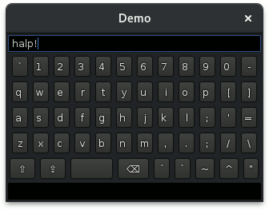

[](https://travis-ci.org/Sciss/VirtualKeyboard)
[](https://maven-badges.herokuapp.com/maven-central/de.sciss/virtualkeyboard)

# Virtual Keyboard for Java SE Applications

A Swing component, useful for on-screen virtual keyboard display, when no physical keyboard
is available (e.g., Raspberry Pi with touch screen). The original author is Wilson de Carvalho,
and the code is released under MIT License. Fork by Hanns Holger Rutz, release under the same
license.

The fork uses [sbt](http://scala-sbt.org/) for building, and publishes an artifact to Maven Central.
It uses a slightly different keyboard layout (more like US keyboard, and with more keys distributed
across the last row), and works nicely with small screen sizes (tested for 320 pixel width Raspberry
Pi touch screen with [WebLaF](https://gitter.im/mgarin/weblaf)).



To build, use `sbt compile`. For a demo, use `sbt test:run`.

To use the Maven artifact:

    "de.sciss" % "virtualkeyboard" % "1.0.0"

## Shortcomings

- some keys are missing, e.g. enter and cursor keys
- conseqeuently, not all characters can be produced, e.g. German `ß` is not available
- keys are only sent to focused instances of `JTextComponent`

The original read-me is below:

-------------------------------

I created this simple virtual keyboard for a small Raspberry Pi application used with a touch screen. It lacks lots of functionalities, but it can do what I need most: the user is able to type and is unable to access function or control keys.

This virtual keyboard was solely designed because I did not find nothing similar (with the limitations I needed) using Swing.

Don't mind to improve this project and propose modifications. It was designed as a Brazilian ABNT2 layout, but you can easily adapt it to your needs.

Ultimately, if you find a better way to control accentuation (which I think was not an elegant code), please let me know. :-)


## How to use

The usage of the virtual keyboard is straightforward. You just have to create a JFrame and a JPanel where you intent to show the keyboard. The keyboard size, as well as buttons dimension will be defined automatically based on the panel size. You can add the virtual keyboard in two different ways:
* Outside the frame class. You must expose the panel through a get method in order to pass it to the VirtualKeyboard class as follows:

```
	VKTest frame = new VKTest();
	frame.setVisible(true);
	VirtualKeyboard vk = new VirtualKeyboard();
	vk.show(frame, frame.getKeyboardPanel());
```

* Inside the frame class. In this sense, you must override the setVisible method, call the super class method and then show the keyboard.

```
	@Override
	public void setVisible(boolean visible) {
		super.setVisible(visible);
		VirtualKeyboard vk = new VirtualKeyboard();
		// Where jPanel is the reference for the keyboard panel
		vk.show(this, jPanel);
	}
```	
